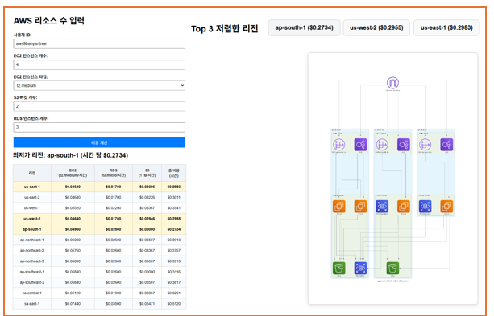
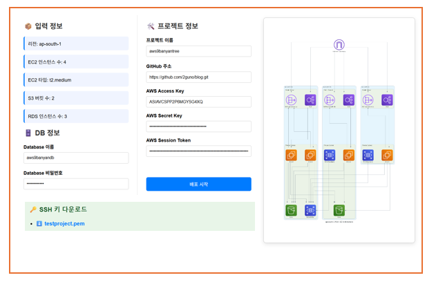

# MSP Service BanyanTree

AWS 기반 멀티 서비스 플랫폼(MSP) 인프라 자동화 및 관리 시스템입니다. 사용자가 웹 인터페이스를 통해 AWS 인프라를 쉽게 설계하고 배포할 수 있는 통합 솔루션을 제공합니다.

## 프로젝트 아키텍처


## Front Web Page

사용자 친화적인 웹 인터페이스를 통해 AWS 인프라를 직관적으로 설계할 수 있습니다.

### 메인 설정 페이지


### 리전 및 리소스 설정 페이지


## 주요 기능

### 1. 웹 기반 인프라 설계 도구
- 직관적인 웹 인터페이스를 통한 AWS 리소스 설계
- 실시간 비용 계산 및 최적화 제안
- 다중 리전 지원 및 가용 영역 자동 배치
- 아키텍처 다이어그램 자동 생성

### 2. 자동화된 인프라 배포
- Terraform 기반 Infrastructure as Code (IaC)
- EC2 기반 Terraform Runner를 통한 안전한 배포
- 멀티 계정 지원으로 다양한 AWS 환경 관리
- 웹훅 기반 자동 배포 파이프라인

### 3. 프로젝트 빌더 시스템
- JSON 스펙을 Terraform 코드로 자동 변환
- 다양한 인프라 템플릿 지원 (VPC, 웹 애플리케이션, 데이터 처리)
- S3 기반 프로젝트 저장 및 버전 관리

## 시스템 구성 요소

### Frontend (웹 인터페이스)
- **기술 스택**: HTML, CSS, JavaScript, Flask
- **주요 파일**:
  - `next.html`: 리전 세부 설정 페이지
  - `app.py`: Flask 백엔드 서버
  - `script.js`: 프론트엔드 로직
  - `my_diagrams.py`: 아키텍처 다이어그램 생성

### EC2 Approach (인프라 배포)
- **Terraform Runner**: EC2 인스턴스에서 실행되는 Terraform 실행 엔진
- **Project Builder**: JSON 스펙을 Terraform 코드로 변환하는 서비스
- **Infrastructure**: 전체 시스템을 위한 AWS 인프라 정의

### 주요 디렉토리 구조
```
MSP_Service_BanyanTree/
├── images/                           # 프로젝트 이미지 파일들
│   ├── msp_project_architecture.png  # 시스템 아키텍처 다이어그램
│   ├── Front_webpage_1.png           # 웹 인터페이스 스크린샷 1
│   └── Front_webpage_2.png           # 웹 인터페이스 스크린샷 2
├── taeseon/
│   ├── Front_End/                    # 웹 인터페이스
│   │   ├── next.html                 # 메인 설정 페이지
│   │   ├── app.py                    # Flask 백엔드
│   │   ├── script.js                 # 프론트엔드 로직
│   │   ├── my_diagrams.py            # 다이어그램 생성
│   │   └── diagrams/                 # 생성된 아키텍처 다이어그램
│   ├── ec2_approach/                 # 인프라 배포 시스템
│   │   ├── infrastructure/           # AWS 인프라 정의
│   │   ├── terraform-runner/         # Terraform 실행 서비스
│   │   ├── project-builder/          # 프로젝트 빌드 서비스
│   │   └── deploy.sh                 # 배포 스크립트
│   └── terraform_templates/          # Terraform 템플릿
```

## 설치 및 배포

### 사전 요구사항
- AWS CLI 설정 완료
- Terraform 설치
- Python 3.x 및 필요한 패키지
- SSH 키 페어 생성

### 1. 인프라 배포
```bash
cd taeseon/ec2_approach
./deploy.sh
```

### 2. 웹 서버 실행
```bash
cd taeseon/Front_End
python app.py
```

## 사용 방법

### 1. 웹 인터페이스를 통한 인프라 설계
1. 웹 브라우저에서 애플리케이션 접속
2. 필요한 AWS 리소스 선택 (EC2, S3, RDS 등)
3. 리전 및 가용 영역 설정
4. 비용 확인 및 최적화

### 2. 인프라 배포
1. Project Builder API를 통한 Terraform 코드 생성:
```bash
curl -X POST http://<PROJECT_BUILDER_IP>:8081/build-project \
     -H "Content-Type: application/json" \
     -d '{
           "project_name": "my-infrastructure",
           "infrastructure_spec": {
             "type": "web_application",
             "vpc_cidr": "10.0.0.0/16",
             "instances": {
               "type": "t3.medium",
               "min_size": 2,
               "max_size": 6
             }
           }
         }'
```

2. Terraform Runner를 통한 배포:
```bash
curl -X POST http://<TERRAFORM_RUNNER_IP>:8080/run-terraform \
     -H "Content-Type: application/json" \
     -d '{
           "project_name": "my-infrastructure",
           "command": "apply",
           "variables": {
             "environment": "production"
           }
         }'
```

## 지원하는 인프라 유형

### 1. VPC 인프라
- 기본 VPC 구성
- 퍼블릭/프라이빗 서브넷
- 인터넷 게이트웨이 및 NAT 게이트웨이

### 2. 웹 애플리케이션
- Application Load Balancer
- Auto Scaling Group
- RDS 데이터베이스
- 보안 그룹 설정

### 3. 데이터 처리
- S3 버킷 구성
- Lambda 함수
- DynamoDB 테이블

## 보안 고려사항

- IAM 역할 기반 권한 관리
- VPC 내 프라이빗 서브넷 배치
- 보안 그룹을 통한 네트워크 접근 제어
- S3 버킷 암호화 및 버전 관리
- DynamoDB를 통한 Terraform 상태 잠금

## 모니터링 및 로깅

- CloudWatch를 통한 시스템 모니터링
- 각 서비스별 로그 파일 관리
- 웹훅 서버 상태 확인 엔드포인트 제공
